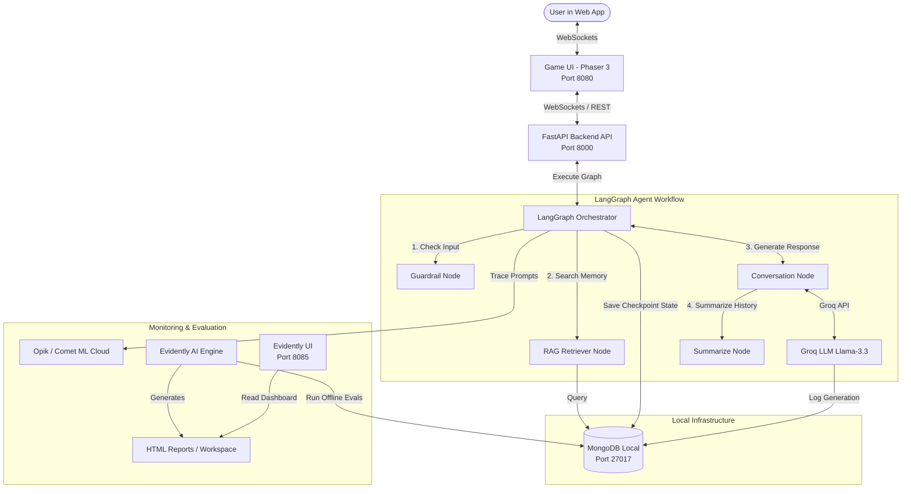
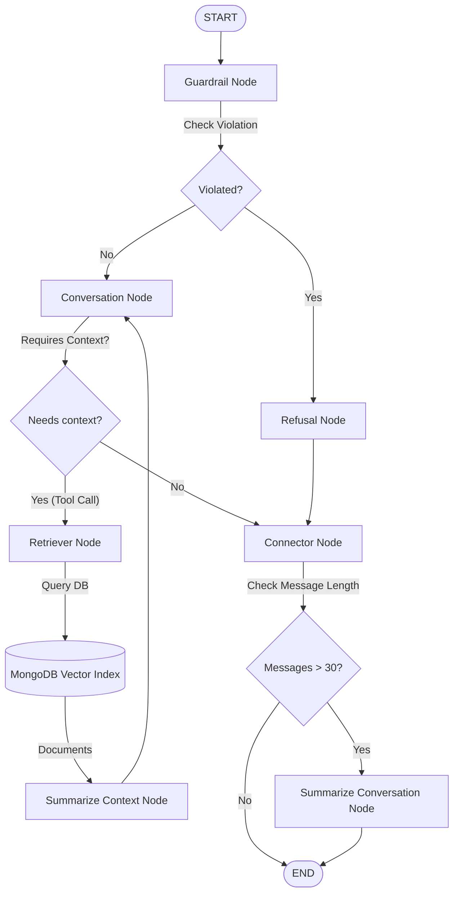
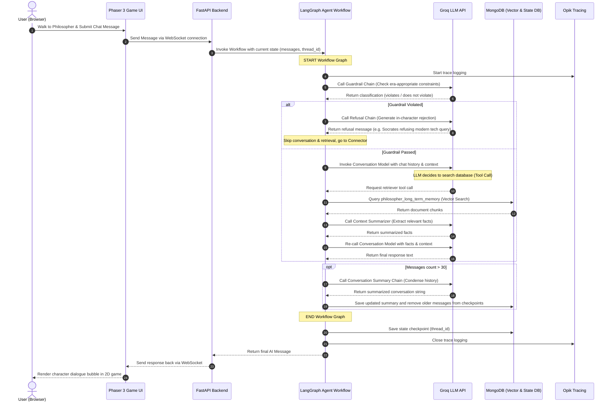

## 🏗️ System Architecture & Workflow

### System Architecture
The system consists of a 2D game frontend, a backend WebSocket/REST server, an agent brain orchestrated with LangGraph, local/cloud storage, and monitoring tools:

The key system components are:
1. **Frontend (Game UI)**: A retro 2D pixel-art game interface built using the **Phaser 3** framework and Webpack. Users walk around and interact with philosophers. It is served on `http://localhost:8080`.
2. **Backend API**: A high-performance **FastAPI** web server running on `http://localhost:8000`. It exposes REST endpoints and active WebSocket connections for real-time, low-latency chat interactions in the game.
3. **Agent Brain**: Orchestrated using **LangGraph** for flexible, state-machine agent interactions. It uses **Groq** for high-speed LLM inference, and **MongoDB** as a document database, vector store, and agent state checkpoint tracker.
4. **Monitoring & Evals**: Integrates with **Opik** (online logging/tracing) and **Evidently AI** (offline evaluations on a test dataset, exposing an HTML report dashboard at `http://localhost:8085`).

### Agent Workflow
The LangGraph agent workflow acts as a state-machine that processes each incoming message through several nodes:

1. **Guardrail Node**: Analyzes the user query using a classification model to see if it violates era-appropriate constraints (e.g. Socrates speaking of modern politics or technologies post-399 BC). If violated, the graph routes to an in-character Refusal Node and skips the conversation node.
2. **Conversation Node**: The central brain. It takes the query, conversation history, and any retrieved contextual memory to craft an in-character response using the Groq API.
3. **Retriever Node**: Executes if the conversation node requests details from the database. It queries the MongoDB vector store for the philosopher's custom context.
4. **Summarize Context Node**: Dynamically summarizes the retrieved document fragments to save context window tokens and filter out irrelevant data.
5. **Connector Node**: Standardizes intermediate state parameters.
6. **Summarize Conversation Node**: Triggered conditionally when the message thread length exceeds 30 messages. It summarizes previous logs, writes them to the `summary` state parameter, and deletes old messages to keep token usage small.

### Detailed Execution Workflow (Sequence Diagram)
Here is the sequence of runtime operations when a user sends a message to a philosopher in town:

---
