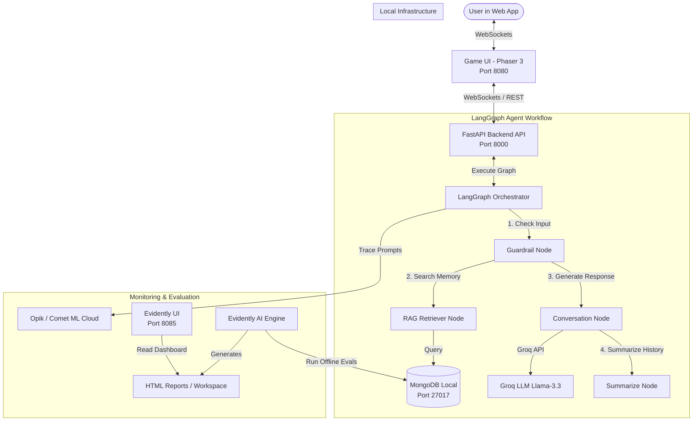

<div align="center">
  <h1>PhiloAgents Course</h1>
  <h3>Learn how to build an AI-powered game simulation engine to impersonate popular philosophers.</h3>
  <p class="tagline">Open-source course by <a href="https://theneuralmaze.substack.com/">The Neural Maze</a> and <a href="https://decodingml.substack.com">Decoding ML</a> in collaboration with </br> <a href="https://rebrand.ly/philoagents-mongodb">MongoDB</a>, <a href="https://rebrand.ly/philoagents-opik">Opik</a> and <a href="https://rebrand.ly/philoagents-groq">Groq</a>.</p>
</div>

</br>

<p align="center">
    
</p>

## 📖 About This Course

Ever dreamed of building your own AI-powered game? Get ready for an exciting journey where we'll combine the thrill of game development with cutting-edge AI technology!

Welcome to **PhiloAgents** (a team-up between [Decoding ML](https://decodingml.substack.com) and [The Neural Maze](https://theneuralmaze.substack.com)) - where ancient philosophy meets modern AI. In this hands-on course, you'll build an AI agent simulation engine that brings historical philosophers to life in an interactive game environment. Imagine having deep conversations with Plato, debating ethics with Aristotle, or discussing artificial intelligence with Turing himself!

**In 6 comprehensive modules**, you'll learn how to:
- Create AI agents that authentically embody historical philosophers
- Master building agentic applications
- Architect and implement a production-ready RAG, LLM and LLMOps system from scratch

### 🎮 The PhiloAgents Experience. What You'll Do:

Transform static NPCs into dynamic AI personalities that:
- Build a game character simulation engine, powered by AI agents and LLMs, that impersonates philosophers from our history, such as Plato, Aristotle and Turing.
- Design production-ready agentic RAG systems.
- Ship the agent as a RESTful API.
- Apply LLMOps and software engineering best practices.
- Use industry tools: Groq, MongoDB, Opik, LangGraph, LangChain, FastAPI, Websockets, Docker, etc.

After completing this course, you'll have access to your own agentic simulation engine, as seen in the video below:

<video src="https://github.com/user-attachments/assets/aedc041e-00ed-42ce-99f2-24ce74847e7a"/></video>

-------

## 🏗️ System Architecture & Workflow

### System Architecture
The system consists of a 2D game frontend, a backend WebSocket/REST server, an agent brain orchestrated with LangGraph, local/cloud storage, and monitoring tools:



The key system components are:
1. **Frontend (Game UI)**: A retro 2D pixel-art game interface built using the **Phaser 3** framework and Webpack. Users walk around and interact with philosophers. It is served on `http://localhost:8080`.
2. **Backend API**: A high-performance **FastAPI** web server running on `http://localhost:8000`. It exposes REST endpoints and active WebSocket connections for real-time, low-latency chat interactions in the game.
3. **Agent Brain**: Orchestrated using **LangGraph** for flexible, state-machine agent interactions. It uses **Groq** for high-speed LLM inference, and **MongoDB** as a document database, vector store, and agent state checkpoint tracker.
4. **Monitoring & Evals**: Integrates with **Opik** (online logging/tracing) and **Evidently AI** (offline evaluations on a test dataset, exposing an HTML report dashboard at `http://localhost:8085`).

### Agent Workflow
The LangGraph agent workflow acts as a state-machine that processes each incoming message through several nodes:

```mermaid
graph TD
    Start([START]) --> Guardrail[Guardrail Node]
    Guardrail -->|Check Violation| IsViolated{Violated?}
    IsViolated -->|Yes| Refusal[Refusal Node]
    IsViolated -->|No| Conversation[Conversation Node]
    
    Conversation -->|Requires Context?| NeedsContext{Needs context?}
    NeedsContext -->|Yes (Tool Call)| Retriever[Retriever Node]
    Retriever -->|Query DB| DB[(MongoDB Vector Index)]
    DB -->|Documents| SummarizeCtx[Summarize Context Node]
    SummarizeCtx --> Conversation
    
    NeedsContext -->|No| Connector[Connector Node]
    Refusal --> Connector
    
    Connector -->|Check Message Length| ShouldSummarize{Messages > 30?}
    ShouldSummarize -->|Yes| SummarizeConv[Summarize Conversation Node]
    ShouldSummarize -->|No| EndNode([END])
    
    SummarizeConv --> EndNode
```

1. **Guardrail Node**: Analyzes the user query using a classification model to see if it violates era-appropriate constraints (e.g. Socrates speaking of modern politics or technologies post-399 BC). If violated, the graph routes to an in-character Refusal Node and skips the conversation node.
2. **Conversation Node**: The central brain. It takes the query, conversation history, and any retrieved contextual memory to craft an in-character response using the Groq API.
3. **Retriever Node**: Executes if the conversation node requests details from the database. It queries the MongoDB vector store for the philosopher's custom context.
4. **Summarize Context Node**: Dynamically summarizes the retrieved document fragments to save context window tokens and filter out irrelevant data.
5. **Connector Node**: Standardizes intermediate state parameters.
6. **Summarize Conversation Node**: Triggered conditionally when the message thread length exceeds 30 messages. It summarizes previous logs, writes them to the `summary` state parameter, and deletes old messages to keep token usage small.

---

## 🛠️ Technologies Used
- **Core Orchestration**: `langgraph`, `langchain-core` for the state-machine workflow agent architecture.
- **LLM Providers**: `langchain-groq` (Llama 3.3 70B & Llama 3.1 8B) for primary inference; `openai` (gpt-4o-mini) as a judge for evaluations.
- **API and Networking**: `fastapi[standard]` for the REST API and WebSocket communication.
- **Database / Vector Search**: `pymongo`, `langchain-mongodb`, `langgraph-checkpoint-mongodb` utilizing MongoDB Atlas Local as a vector store, document database, and checkpointer.
- **Embedding Model**: `sentence-transformers/all-MiniLM-L6-v2` via HuggingFace for encoding knowledge bases into 384-dimensional dense vectors.
- **Observability**: `opik` for real-time prompt telemetry and tracing.
- **Evaluation**: `evidently` for text quality, sentiment analysis, correctness, faithfulness, and context quality.
- **Development Tooling**: `uv` for python environments, Docker & Docker Compose, Webpack, npm, and GNU Make.

-------

<table style="border-collapse: collapse; border: none;">
  <tr style="border: none;">
    <td width="20%" style="border: none;">
      <a href="https://theneuralmaze.substack.com/" aria-label="The Neural Maze">
        
      </a>
    </td>
    <td width="80%" style="border: none;">
      <div>
        <h2>📬 Stay Updated</h2>
        <p><b><a href="https://theneuralmaze.substack.com/">Join The Neural Maze</a></b> and learn to build AI Systems that actually work, from principles to production. Every Wednesday, directly to your inbox. Don't miss out!
</p>
      </div>
    </td>
  </tr>
</table>

<p align="center">
  <a href="https://theneuralmaze.substack.com/">
    
  </a>
</p>

<table style="border-collapse: collapse; border: none;">
  <tr style="border: none;">
    <td width="20%" style="border: none;">
      <a href="https://decodingml.substack.com/" aria-label="Decoding ML">
        
      </a>
    </td>
    <td width="80%" style="border: none;">
      <div>
        <h2>📬 Stay Updated</h2>
        <p><b><a href="https://decodingml.substack.com/">Join Decoding ML</a></b> for proven content on designing, coding, and deploying production-grade AI systems with software engineering and MLOps best practices to help you ship AI applications. Every week, straight to your inbox.</p>
      </div>
    </td>
  </tr>
</table>

<p align="center">
  <a href="https://decodingml.substack.com/">
    
  </a>
</p>

## 🎯 What You'll Learn

While building the PhiloAgents simulation engine, you'll master:

- Building intelligent agents with LangGraph
  - Agent development and orchestration
  - RAG agentic communication patterns
  - Character impersonation through prompt engineering (Plato, Aristotle, Turing)

- Creating production-grade RAG systems
  - Vector database integration
  - Knowledge base creation from Wikipedia and Stanford Encyclopedia
  - Advanced information retrieval

- Engineering the system architecture
  - End-to-end design (UI → Backend → Agent → Monitoring)
  - RESTful API deployment with FastAPI and Docker
  - Real-time communication via WebSockets

- Implementing advanced agent features
  - Short and long-term memory with MongoDB
  - Dynamic conversation handling
  - Real-time response generation

- Mastering industry tools and practices
  - Integration with Groq, MongoDB, Opik
  - Modern Python tooling (uv, ruff)
  - LangChain and LangGraph ecosystems
  - Leveraging LLMs on GroqCloud for high-speed inference

- Applying LLMOps best practices
  - Automated agent evaluation
  - Prompt monitoring and versioning
  - Evaluation dataset generation

🥷 By the end, you'll be a ninja in production-ready AI agent development!

## 👥 Who Should Join?

**This course is tailored for people who learn by building.** After completing the course, you will have your own code template and enough inspiration to develop your personal agentic applications.

| Target Audience | Why Join? |
|-----------------|-----------|
| ML/AI Engineers | Build production-ready agentic applications (beyond Notebook tutorials). |
| Data/Software Engineers | Architect end-to-end agentic applications. |
| Data Scientists | Implement production agentic systems using LLMOps and SWE best practices. |

## 🎓 Prerequisites

| Category | Requirements |
|----------|-------------|
| **Skills** | - Python (Beginner) <br/> - Machine Learning, LLMs, RAG (Beginner) |
| **Hardware** | Modern laptop/PC (We will use Groq and OpenAI APIs to call our LLMs) |
| **Level** | Beginner to Intermediate |


## 💰 Cost Structure

**The course is open-source and completely free!** You can run the simulation engine without any of the advanced LLMOps features at 0 cost.

If you choose to run the entire system end-to-end (this is optional), the maximum cost for cloud tools is approximately $1:

| Service | Estimated Maximum Cost |
|---------|------------------------|
| Groq's API | $0 |
| OpenAI's API (Optional) | ~$1 |

In Module 5 (optional module), we use OpenAI's API as an LLM-as-a-judge to evaluate our agents. In the rest of the course, we use Groq's API, which offers a free tier.

**Just reading the materials? It's all free!**

## 🥂 Open-source Course: Participation is Open and Free

As an open-source course, you don't have to enroll. Everything is self-paced, free of charge, and with its resources freely accessible at (video and articles are complementary - go through both for the whole picture):
- **code**: this GitHub repository
- **videos**: [The Neural Maze](https://www.youtube.com/@TheNeuralMaze)
- **articles**: [Decoding ML](https://decodingml.substack.com)

## 📚 Course Outline

This **open-source course consists of 6 comprehensive modules** covering theory, system design, and hands-on implementation.

[Read this](https://decodingml.substack.com/p/from-0-to-pro-ai-agents-roadmap) for a quick walkthrough of what you will learn in each module.

Our recommendation for getting the most out of this course:
1. Clone the repository.
2. Read the materials (video and articles are complementary - go through both for the whole picture)
3. Set up the code and run it to replicate our results.
4. Go deeper into the code to understand the details of the implementation.


| Module | Written Lesson | Video Lesson | Description | Running the code |
|--------|----------------|--------------|-------------|------------------|
| <div align="center">0</div>  | <a href="https://decodingml.substack.com/p/from-0-to-pro-ai-agents-roadmap"></a> | <div align="center">**No Video**</div> | Quick walkthrough over what you will learn in each module. | <div align="center">**No code**</div> |
| <div align="center">1</div>  | <a href="https://decodingml.substack.com/p/build-your-gaming-simulation-ai-agent"></a> | <a href="https://youtu.be/vbhShB70vFE?si=tK0hRQbEqlZMwFMm"></a> | Architect your gaming simulation AI PhiloAgent. | <div align="center">**No code**</div> |
| <div align="center">2</div> | <a href="https://decodingml.substack.com/p/your-first-production-ready-rag-agent"></a> | <a href="https://youtu.be/5fqkdiTP5Xw?si=Y1erl41qNSYlSaYx"></a> | Building the PhiloAgent in LangGraph using agentic RAG. | [philoagents-api](philoagents-api) |
| <div align="center">3</div> | <a href="https://decodingml.substack.com/p/memory-the-secret-sauce-of-ai-agents"></a> | <a href="https://youtu.be/xDouz4WNHV0?si=t2Wk179LQnSDY1iL"></a> | Wrapping up our agentic RAG layer by implementing the short-term and long-term memory components. | [philoagents-api](philoagents-api) |
| <div align="center">4</div> | <a href="https://decodingml.substack.com/p/deploying-agents-as-real-time-apis"></a>  | <a href="https://youtu.be/svABzOASrzg?si=nylMpFm0nozPNSbi"></a> | Expose the agent as a RESTful API (FastAPI + Websockets). | [philoagents-api](philoagents-api) |
| <div align="center">5</div> | <a href="https://decodingml.substack.com/p/observability-for-rag-agents"></a>  | <a href="https://youtu.be/Yy0szt5OlNI?si=otYpqM_BY2gxdxnS"></a> | Observability for RAG agents (part of LLMOps): evaluating agents, prompt monitoring, prompt versioning, etc. | [philoagents-api](philoagents-api) |
| <div align="center">6</div> | <a href="https://decodingml.substack.com/p/engineer-python-projects-like-a-pro"></a>   | <div align="center">**No Video**</div> | Structuring Python projects like a PRO. Modern Python tooling. Docker setup. | [philoagents-api](philoagents-api) |

And if you're feeling extra brave, there's also a 2h 30m video course where we have merged all the video lessons into one.

<p align="center">
    <a href="https://youtu.be/pg1Sn9rsFak?si=bKMdL-EbaMb90PT3"></a>
</p>


------

<table style="border-collapse: collapse; border: none;">
  <tr style="border: none;">
    <td width="20%" style="border: none;">
      <a href="https://theneuralmaze.substack.com/" aria-label="The Neural Maze">
        
      </a>
    </td>
    <td width="80%" style="border: none;">
      <div>
        <h2>📬 Stay Updated</h2>
        <p><b><a href="https://theneuralmaze.substack.com/">Join The Neural Maze</a></b> and learn to build AI Systems that actually work, from principles to production. Every Wednesday, directly to your inbox. Don't miss out!
</p>
      </div>
    </td>
  </tr>
</table>

<p align="center">
  <a href="https://theneuralmaze.substack.com/">
    
  </a>
</p>

<table style="border-collapse: collapse; border: none;">
  <tr style="border: none;">
    <td width="20%" style="border: none;">
      <a href="https://decodingml.substack.com/" aria-label="Decoding ML">
        
      </a>
    </td>
    <td width="80%" style="border: none;">
      <div>
        <h2>📬 Stay Updated</h2>
        <p><b><a href="https://decodingml.substack.com/">Join Decoding ML</a></b> for proven content on designing, coding, and deploying production-grade AI systems with software engineering and MLOps best practices to help you ship AI applications. Every week, straight to your inbox.</p>
      </div>
    </td>
  </tr>
</table>

<p align="center">
  <a href="https://decodingml.substack.com/">
    
  </a>
</p>

## 🏗️ Project Structure

While building the PhiloAgents simulation engine, we will rely on two separate applications:

```bash
.
├── philoagents-api/     # Backend API containing the PhiloAgents simulation engine (Python)
└── philoagents-ui/      # Frontend UI for the game (Node)
```

The course will focus only on the `philoagents-api` application that contains all the agent simulation logic. The `philoagents-ui` application is used to play the game.

## 👔 Dataset

To impersonate our philosopher agents with real-world knowledge, we will populate their long-term memory with data from:
- Wikipedia
- The Stanford Encyclopedia of Philosophy

You don't have to download anything explicitly. While populating the long-term memory, the `philoagents-api` application will download the data from the internet automatically.

## 🎭 Philosopher Characters & Conversational Tones
The system supports ten standard historical figures and three newly integrated Indian philosophical characters. Every character has a specific personality profile, style, era configuration, and knowledge base:

| Philosopher | Style | Persona & Era Rules |
|-------------|-------|---------------------|
| **Socrates** | Friendly, humble, curious | Probes ethical foundations with relentless curiosity. Era: Classical Greece (c. 470 – 399 BC). |
| **Plato** | Mystical, poetic | Uses visionary metaphors (e.g., the Allegory of the Cave). Era: Classical Greece (c. 428 – 348 BC). |
| **Aristotle** | Logical, analytical | Organizes thoughts systematically. Era: Classical Greece (c. 384 – 322 BC). |
| **Descartes** | Skeptical, bilingual (French) | Questions existence and consciousness. Era: Early Modern Europe (1596 – 1650 AD). |
| **Leibniz** | Serious, dry | Connects math with cosmic calculus. Era: Early Modern Europe (1646 – 1716 AD). |
| **Ada Lovelace** | Technical, artistic, poetic | Integrates computation with creative imagination. Era: Victorian Era Britain (1815 – 1852 AD). |
| **Alan Turing** | Friendly, technical | Loves puzzles and thought experiments (e.g., Turing Test). Era: Mid-20th Century (1912 – 1954 AD). |
| **Noam Chomsky** | Serious, deep | Linguistically deconstructs AI hype. Era: Modern Era (1928 – Present). |
| **John Searle** | Academic, dry humor | Argues semantics vs. syntax (e.g., Chinese Room). Era: Modern Era (1932 – Present). |
| **Daniel Dennett** | Sarcastic, ironic | Explains consciousness with down-to-earth metaphors. Era: Modern Era (1942 – 2024 AD). |
| **Krishna** (Custom) | Poetic, compassionate, peaceful | Explores Karma, Dharma, and the Atman (Self) using wisdom from the Bhagavad Gita. Era: Ancient India (Timeless / c. 3100 BC). |
| **Buddha** (Custom) | Tranquil, gentle, mindful | Discusses impermanence (Anicca), non-self (Anatta), and mindfulness. Era: Ancient India (c. 563 – 483 BC). |
| **Chanakya** (Custom) | Sharp, direct, authoritative | Focuses on pragmatism, containment, security, and governance (Arthashastra). Era: Ancient Mauryan Empire (c. 375 – 283 BC). |

---

## 📊 LLM Observability & Evaluation (Evidently AI)
To ensure our agents converse accurately and stay in character, the project includes an offline evaluation suite using **Evidently AI**:
- **Dataset**: Built from predefined golden query-response test cases at [evaluation_dataset.json](philoagents-api/data/evaluation_dataset.json).
- **Core Metrics & Descriptors**:
  - **TextLength**: Measures character length of generated response.
  - **Sentiment**: Computes sentiment polarity (positive, neutral, negative) to check if the tone is aligned.
  - **Semantic Similarity**: Computes similarity between generated response and expected response using sentence embeddings.
  - **LLM-as-a-Judge Metrics** (utilizing `gpt-4o-mini` via OpenAI API):
    - **Correctness**: Checks if the generated answer matches the expected answer factually.
    - **Faithfulness**: Checks if the generated response is fully supported by the retrieved context (detecting hallucinations).
    - **Context Quality**: Measures how relevant the retrieved context from MongoDB was to the user query.
    - **Toxicity**: Evaluates if the response contains any toxic language.
- **Evidently UI**: The results are saved as standalone HTML/JSON files (`data/evidently_report.html`) and logged to a local workspace (`workspace/`) which can be visualized in real-time by running the Evidently UI server (`http://localhost:8085`).

---

## 🌐 Local Host Port Directory
Here is a directory of the ports and endpoints used during local development:

| Service | Local URL / Port | Description |
|---------|------------------|-------------|
| **Game UI** | `http://localhost:8080` | Web interface to play the simulation |
| **Agent API** | `http://localhost:8000` | FastAPI server handling agent requests |
| **API Docs** | `http://localhost:8000/docs` | Swagger interactive docs for the backend API |
| **Evidently UI** | `http://localhost:8085` | Dashboard to view offline evaluation metrics |
| **MongoDB Database** | `localhost:27017` | Local MongoDB Atlas database container |
| **Opik Dashboard** | Cloud Service | `https://www.comet.com/opik/` for prompt logging & tracing |

---

## 🚀 Getting Started

Find detailed setup and usage instructions in the [INSTALL_AND_USAGE.md](INSTALL_AND_USAGE.md) file.

**Pro tip:** Read the accompanying articles first for a better understanding of the system you'll build.

## 🔧 Troubleshooting & Common Setup Issues

We have identified common configuration issues and provided detailed solutions below.

### 1. Error: `.env` file not found
* **Symptoms**:
  `env file C:\Users\apras\Desktop\Philoagents\philoagents-api\.env not found: The system cannot find the file specified.` when running `docker compose up`.
* **Cause**: Docker Compose looks for `philoagents-api/.env` as defined in `docker-compose.yml` (`env_file: - ./philoagents-api/.env`), but it has not been created yet.
* **Solution**: Create the file from `.env.example`:
  ```powershell
  # Windows Powershell / CMD
  copy philoagents-api\.env.example philoagents-api\.env
  ```
  And populate the required API keys (e.g., `GROQ_API_KEY`, and optionally `OPENAI_API_KEY` or `COMET_API_KEY` for evaluation).

### 2. Issue: Heavy Docker Image Build Overhead (Torch / CUDA wheel download)
* **Symptoms**: When building the `api` container image, the build hangs or takes a very long time during `uv sync --frozen --no-cache` downloading large wheels (`torch`, `nvidia-*` packages totaling ~2GB).
* **Cause**: Docker builds run on a Linux-based virtual machine where `uv sync` installs the dependencies specified in `pyproject.toml`. By default, Python wheel installations for libraries like PyTorch fall back to CUDA wheels on Linux.
* **Solution**: Run the database in Docker, but run the API and UI services locally! This is the recommended lightweight developer workflow:
  1. **Start the database only**:
     ```bash
     docker compose up local_dev_atlas -d
     ```
  2. **Install and run the Backend locally**:
     ```bash
     cd philoagents-api
     uv venv
     .venv\Scripts\activate
     uv pip install -e .
     # Create the database vector memory
     uv run python -m tools.create_long_term_memory
     # Start backend server
     uv run fastapi run src/philoagents/infrastructure/api.py --port 8000
     ```
  3. **Install and run the Frontend UI locally**:
     ```bash
     cd philoagents-ui
     npm install
     npm run dev
     ```

### 3. Error: `make` Command Not Found on Windows
* **Symptoms**: Running commands like `make infrastructure-up` fails with `'make' is not recognized as an internal or external command`.
* **Cause**: GNU Make is not natively included in Windows.
* **Solution**:
  - Download and install **GnuWin32 Make** (typically installs to `C:\Program Files (x86)\GnuWin32\bin`).
  - Add GnuWin32's `bin` folder to your session path in PowerShell:
    ```powershell
    $env:PATH += ";C:\Program Files (x86)\GnuWin32\bin"
    ```
  - Alternatively, bypass `make` and run the commands directly in your terminal. For example, run `docker compose up local_dev_atlas -d` instead of `make infrastructure-up`.

### 4. WSL Requirement for Windows Users
* **Symptoms**: UNIX commands like `cp` or `source ./.venv/bin/activate` fail inside standard cmd.exe.
* **Cause**: Windows cmd/PowerShell uses different command conventions and paths.
* **Solution**: Use Windows Subsystem for Linux (WSL) for a native Linux environment, or run the equivalent Windows commands (e.g. `copy` instead of `cp`, and `.\.venv\Scripts\activate` instead of `source`).

---

## 💡 Questions and Troubleshooting

Have questions or running into issues? We're here to help!

Open a [GitHub issue](https://github.com/neural-maze/philoagents-course/issues) for:
- Questions about the course material
- Technical troubleshooting
- Clarification on concepts

## 🥂 Contributing

As an open-source course, we may not be able to fix all the bugs that arise.

If you find any bugs and know how to fix them, support future readers by contributing to this course with your bug fix.

You can always contribute by:
- Forking the repository
- Fixing the bug
- Creating a pull request

📍 [For more details, see the contributing guide.](CONTRIBUTING.md)

We will deeply appreciate your support for the AI community and future readers 🤗

## Sponsors

<div align="center">
  <table style="border-collapse: collapse; border: none;">
    <tr style="border: none;">
      <td align="center" style="border: none; padding: 20px;">
        <a href="https://rebrand.ly/philoagents-mongodb" target="_blank">
          
        </a>
      </td>
      <td align="center" style="border: none; padding: 20px;">
        <a href="https://rebrand.ly/philoagents-opik" target="_blank">
          
        </a>
      </td>
      <td align="center" style="border: none; padding: 20px;">
        <a href="https://rebrand.ly/philoagents-groq" target="_blank">
          
        </a>
      </td>
    </tr>
  </table>
</div>

## Core Contributors

<table>
  <tr>
    <td align="center">
      <a href="https://github.com/iusztinpaul">
        <br />
        <sub><b>Paul Iusztin</b></sub>
      </a><br />
      <sub>AI/ML Engineer</sub>
    </td>
    <td align="center">
      <a href="https://github.com/MichaelisTrofficus">
        <br />
        <sub><b>Miguel Otero Pedrido</b></sub>
      </a><br />
      <sub>AI/ML Engineer</sub>
    </td>
  </tr>
</table>

## License

This project is licensed under the MIT License - see the [LICENSE](LICENSE) file for details.

------

<table style="border-collapse: collapse; border: none;">
  <tr style="border: none;">
    <td width="20%" style="border: none;">
      <a href="https://theneuralmaze.substack.com/" aria-label="The Neural Maze">
        
      </a>
    </td>
    <td width="80%" style="border: none;">
      <div>
        <h2>📬 Stay Updated</h2>
        <p><b><a href="https://theneuralmaze.substack.com/">Join The Neural Maze</a></b> and learn to build AI Systems that actually work, from principles to production. Every Wednesday, directly to your inbox. Don't miss out!
</p>
      </div>
    </td>
  </tr>
</table>

<p align="center">
  <a href="https://theneuralmaze.substack.com/">
    
  </a>
</p>

<table style="border-collapse: collapse; border: none;">
  <tr style="border: none;">
    <td width="20%" style="border: none;">
      <a href="https://decodingml.substack.com/" aria-label="Decoding ML">
        
      </a>
    </td>
    <td width="80%" style="border: none;">
      <div>
        <h2>📬 Stay Updated</h2>
        <p><b><a href="https://decodingml.substack.com/">Join Decoding ML</a></b> for proven content on designing, coding, and deploying production-grade AI systems with software engineering and MLOps best practices to help you ship AI applications. Every week, straight to your inbox.</p>
      </div>
    </td>
  </tr>
</table>

<p align="center">
  <a href="https://decodingml.substack.com/">
    
  </a>
</p>
